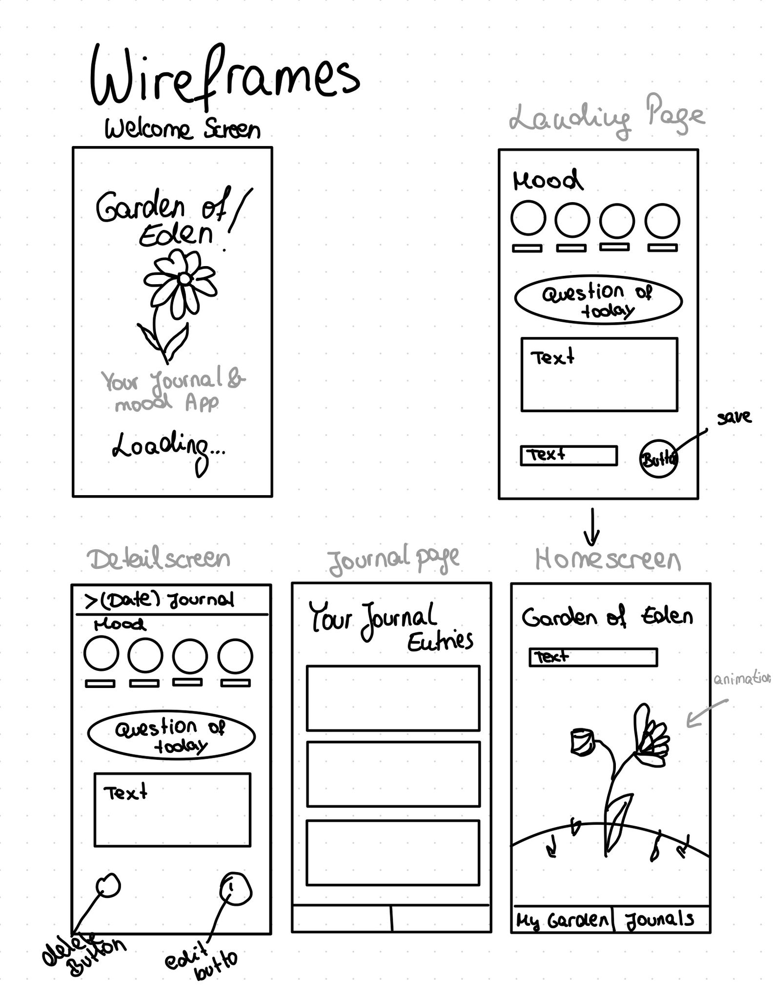

# GardenOfEden

## Brief Description
Discover Garden of Eden, the ultimate app for enhancing self-awareness and emotional well-being! 
With daily mood tracking and guided journaling, you’ll reflect on unique, thought-provoking questions 
while nurturing your personal virtual garden—where each plant represents an emotion. 
Start cultivating your emotional wellness today—because your journey to growth and serenity begins here!

## Team Members
- Helena Vishkurti
- Klarissa Breitkopf
  
# CCL3 Documentation
For detailed information, please refer to the [CCL3 Documentation](docs/documentation.md).

### Target User
Adults aged 18-75 who want to track their emotional progress, 
heal through journaling, and find peace by nurturing their personal "Garden of Eden" within the app.

### Mockups

### User Flow
- **Welcome Page**: Displays the loading page for the app.
- **Landing Page**: It's a once-per-day screen that includes: Mood of the day & Question of the day.
- **Home Page - Garden**: Displays the garden with mood specific plants.
- **Journal Page**: Shows the list of all entries/questions.
- **Detail Journal Page**: Shows the details on a specific entry. Entry can be edited and deleted.

### Navigation
- Loading > Landing > Home
- Home > Journal > Detail Screen

# Usability Test Documentation

For detailed information on usability tests, please refer to the [Usability Test Documentation](docs/usability_tests.md).
